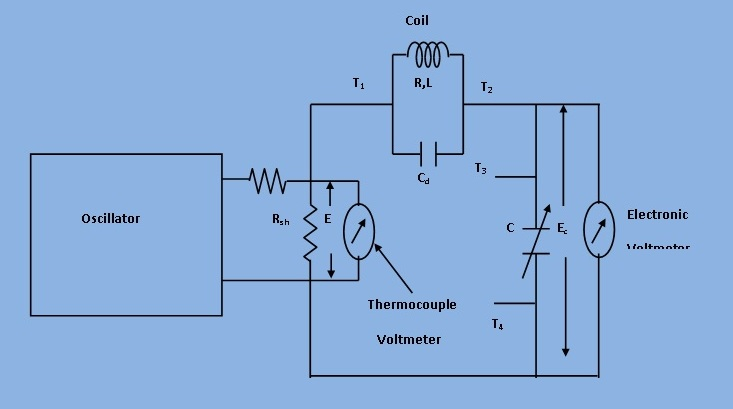

## Introduction

Figure 1 shows a very high resistance R with its two main terminals A and B and a guard terminal, which is put on the insulation. This high resistance may be diagramatically represented as in Fig. 2.

***[Fig 1]***

***[Fig 2]***

The resistance R is between main terminals A and B and the leakage resistances Rag and Rbg between the main terminals A and B of form a "Three terminal resistance". Let us consider the hypothetically case of a `100 MΩ` resistance. We assume that each of the leakage resistances is also the same values. Measured by ordinary wheatstone bridge method, we get the value of `67MΩ` and the giving error of `33%` of original value.

***[Fig 3]***

However, if the same resistance is measured by a modified wheatstone bridge as shown in Fig.3 the error in measuremnt is considerably reduced. For the arrangement shown in Fig.4 resistance Rbg is put in parallel with the galvanometer and thus it has no effect on the balance and only effects the sensitivity of the galvanometer slightly. Sensitivity for balancing against high resistance is obtained by use of adjustable high voltage supplies of 500V or 1000V and the use of a sensitive null indicating arrangement. The dial on Q is calibrated 1-10-100-1000M, with main decade 1-10 occupying greater part of the dial space. Since unknown resistance R=PS/Q ,the arm Q is made tapered, so that the dial calibration is approximately logarithmic in the main decade, 1-10. Arm S gives five multipliers, 0.1,1,10,100 and 1000.

***[Fig 4]***

The arrangement of Fig.4 illustrates the operation of a Megohm bridge. Fig.4 shows the circuit completely self contained megohm bridge which includes power supplies, bridge members, amplifiers and indicating instrument. It has a range from `0.1MΩ` to `10^6MΩ`. The accuracy is within `3%` for the lower part of the range to possible `10%` above `10,000 MΩ`.
